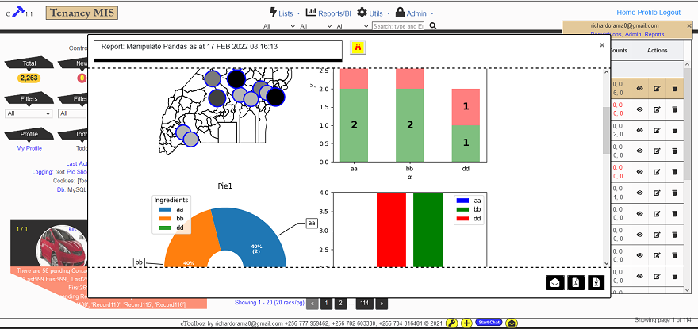
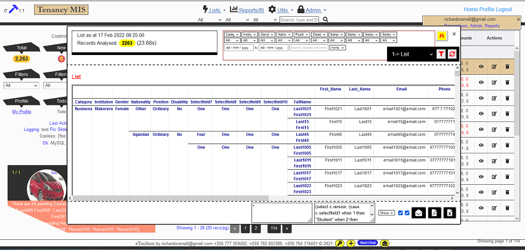
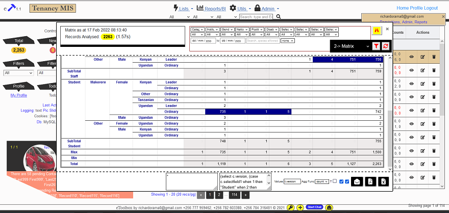

## Data Science with Python Tips
A useful and handy collection of practical Python Tips gathered from everyday encounters through my own projects. The scope will include Python methodologies for data collection (through design of data entry forms), storage (through relational database), wrangling/analysis (through Python libraries), and anything else that matters. The argument is that data science is not possible without these very important stages of the data life cycle. Frequently and notably so - there is an intersection with Business Intelligence. After all, it is all about making sense of data.

### Motivation for this project
In the spirit of sharing, this project is an accumulation of some of the daily recording of work done as part of several projects. As you know, everyday provides an opportunity to learn, no matter your level of expertise. Therefore, I share some very basic as well as some rather advanced tips.

There are many web development frameworks and libraries all over. In the case of Python, we can talk of Flask, Django, etc frameworks; as well as libraries/tools such as Pandas, Matplotlib, Plotly, Numpy, Celery, SQLAlchemy, etc. With the growing need for development projects, many find themselves in a situation where they use a framework or library/tool without first understandig the basic principles of programming and the specific language fundamentals. Data Structures is one that suffers heavily in such a circumstance.

This project only aims to help those who might find themselves in such circumstances. It just touches on the very basics, nothing more. It is simply a wake up call that programming/development requires much more than creating a data entry form, connecting to a database and allowing users to enter data. With all available online resources, we all should endavor to learn the fundamentals before diving into any framework.

Currently, I share some Python language fundamentals and basic/advanced examples of Pandas analysis, but will be expanding with time. 

- Python Data Structures
- Some Python language fundamentals
- Pandas (including practical use-cases of web-scraping and analysis of data about weather and currency exchange rates). Also analysis of telephone call logs.
- GeoPandas (including practical use-cases of all major geo-processing tasks)
- Plotly
- Matplotlib

In time, I hope to include tips on Flask, SQLAlchemy, and other related libraries that I have used in recent and current times.

To demonstrate some outputs of my project that are not possible to include in the repo for good reasons, please see the screenshots below that are taken from my Flask web application that contains these functionalities.

### Samples of dynamic, interactive, and styled reports delivered in a Flask web-application and MySQL database

 

#### Geopandas with Pandas and Matplotlib
<table border="1"><tr><td>
  
</td></tr></table>

 

#### Pandas with Plotly 
<table border="1"><tr><td>
  
</td></tr></table>

 

#### Pandas with simple Re-indexing
<table border="1"><tr><td>
  
</td></tr></table>

 

#### Pandas with Pivot Table
<table border="1"><tr><td>
  
</td></tr></table>

