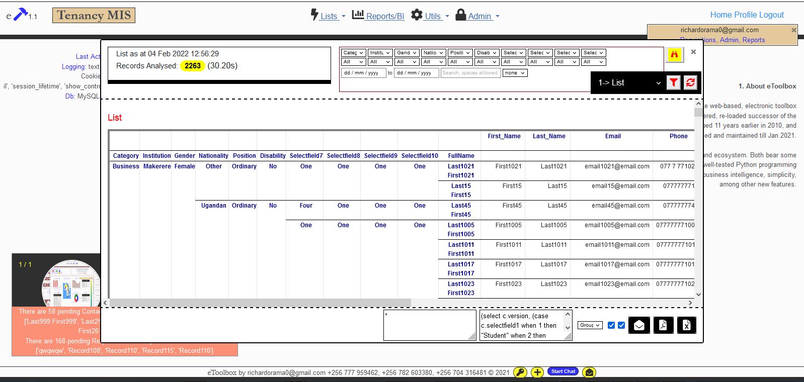

## Data Science with Python Tips
A useful and handy practical collection of Python Tips picked from my own projects

### Motivation for this project
In the spirit of sharing, this project is an accumulation of some of the daily recording of work done as part of several projects. As you know, everyday provides an opportunity to learn, no matter your level of expertise. Therefore, I share some very basic as well as some rather advanced tips.

There are many web development frameworks and libraries all over. In the case of Python, we can talk of Flask, Django, etc frameworks; as well as libraries such as Pandas, Matplotlib, Plotly, Numpy, Celery, etc. With the growing need for development projects, many find themselves in a situation where they use a framwork or library without first understandig the basic principles of programming and the specific language fundamentals. Data Structures is one that suffers heavily in such a circumstance.

This project only aims to help those who might find themselves in such circumstances. It just touches on the very basics, nothing more. It is simply a wake up call that programming/development requires much more than creating a data entry form, connecting to a database and allowing users to enter data. With all available online resources, we all should endavor to learn the fundamentals before diving into any framework.

Currently, I share some Python language fundamentals and basic/advanced examples of Pandas analysis, but will be expanding with time. 

- Python Data Structures
- Some Python language fundamentals
- Pandas (including practical use-cases of web-scraping and analysis of data about weather and currency exchange rates). Also analysis of telephone call logs.
- GeoPandas (including practical use-cases of all major geo-processing tasks)
- Plotly
- Matplotlib

In time, I hope to include tips on Flask, SQLAlchemy, and other related libraries that I used in some recent develpoments.

To demonstrate some outputs of my project that are not possible to include in the repo for good reasons, please see the screenshots below that are taken from my Flask web application that contains these functionalities.

### Pandas with Plotly (dynamic and interactive, styled report delivered in a Flask web-application)
<table  style="border: 2px solid red;"><tr><td>
  
</td></tr></table>

### Pandas with Pivot Table (dynamic and interactive, styled report delivered in a Flask web-application)
<table  style="border: 2px solid red;"><tr><td>
  
</td></tr></table>

### Pandas with simple Re-indexing (dynamic and interactive, styled report delivered in a Flask web-application)
<table  style="border: 2px solid red;"><tr><td>
  
</td></tr></table>

